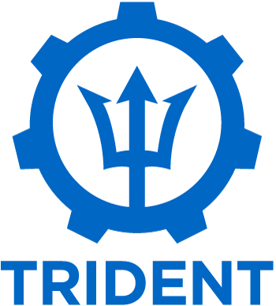

Trident is a fully supported open source project maintained by [NetApp](https://www.netapp.com). It has been designed
from the ground up to help you meet your containerized applications' persistence demands using industry-standard
interfaces, such as the [Container Storage Interface (CSI)](https://kubernetes-csi.github.io/docs/introduction.html).

Trident deploys in Kubernetes clusters as pods and provides dynamic storage orchestration services for your Kubernetes workloads. It enables your containerized applications to quickly and easily consume persistent storage from NetApp’s broad portfolio that
includes [ONTAP](https://www.netapp.com/data-management/ontap-data-management-software) (AFF/FAS/Select/Cloud), [Element](https://www.netapp.com/data-management/element-software) (HCI/SolidFire), as well as the [Azure NetApp Files](https://cloud.netapp.com/azure-netapp-files)
service, [Cloud Volumes Service on Google Cloud](https://cloud.netapp.com/cloud-volumes-service-for-gcp), and [Amazon FSx for ONTAP](https://cloud.netapp.com/fsx-for-ontap).

Trident is also a foundational technology for NetApp's [Astra](http://cloud.netapp.com/Astra), which addresses your data protection, disaster recovery, portability, and migration use cases for
Kubernetes workloads leveraging NetApp's industry-leading data management technology for snapshots, backups, replication, and cloning.

Detailed documentation for Trident can be found [here](https://docs.netapp.com/us-en/trident/index.html).

Take a look at the [Astra documentation](https://docs.netapp.com/us-en/astra/) to get started today.

See [NetApp's Support site](https://mysupport.netapp.com/site/info/version-support) for details on Trident's support policy under the [Trident's Release and Support Lifecycle](https://mysupport.netapp.com/site/info/trident-support) tab.
