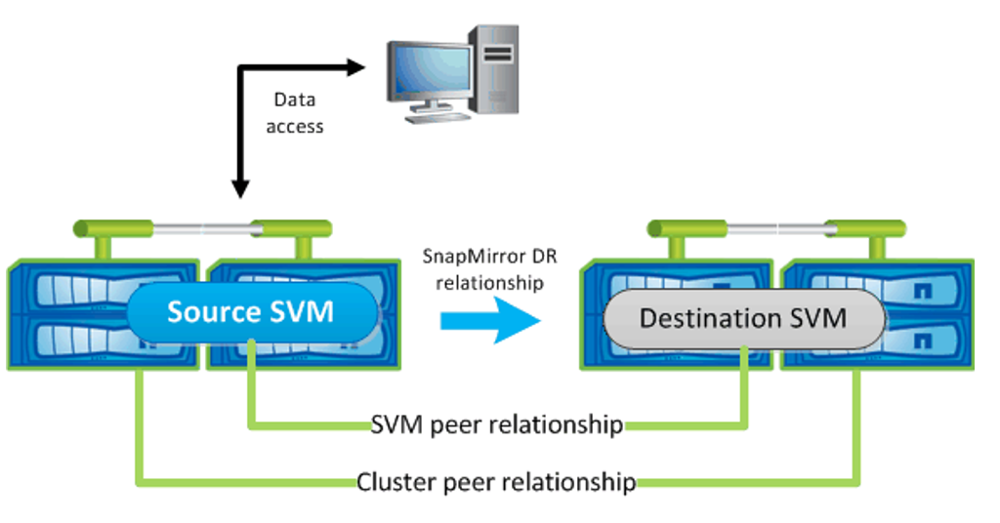
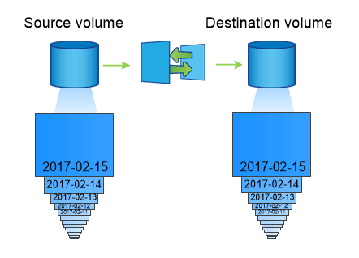

.. _backup_disaster_recovery:

****************************
Backup and Disaster Recovery
****************************

Protecting application data is one of the fundamental purposes of any storage system. Whether an application is cloud native, 12 factor, a microservice, or any other architecture, the application data still needs to be protected.

NetApp's storage platforms provide data protection and recoverability options which vary based on recovery time and acceptable data loss requirements. Trident can provision volumes which can take advantage of some of these features, however, a full data protection and recovery strategy should be evaluated for each application with a persistence requirement.

Backing Up Kubernetes and Trident's state
=========================================

Trident v19.07 and beyond will now utilize Kubernetes CRDs to store and manage
its state. As a result, Trident will store its metadata in the Kubernetes cluster's etcd database.
All Kubernetes objects are stored in the cluster's etcd. Periodically backing up the etcd cluster
data is important to recover Kubernetes clusters under disaster scenarios.

This example provides a sample workflow to create etcd snapshots on a Kubernetes cluster using
``etcdctl``.

etcdctl snapshot backup
-----------------------

The command ``etcdctl snapshot save`` enables us to take a point-in-time snapshot of the etcd cluster.

.. code-block:: console

   sudo docker run --rm -v /backup:/backup \
    --network host \
    -v /etc/kubernetes/pki/etcd:/etc/kubernetes/pki/etcd \
    --env ETCDCTL_API=3 \
    k8s.gcr.io/etcd-amd64:3.2.18 \
    etcdctl --endpoints=https://127.0.0.1:2379 \
    --cacert=/etc/kubernetes/pki/etcd/ca.crt \
    --cert=/etc/kubernetes/pki/etcd/healthcheck-client.crt \
    --key=/etc/kubernetes/pki/etcd/healthcheck-client.key \
    snapshot save /backup/etcd-snapshot.db

This command creates an etcd snapshot by spinning up an etcd container
and saves it in the ``/backup`` directory.

etcdctl snapshot restore
------------------------

In the event of a disaster, it is possible to spin up a Kubernetes cluster using the etcd snapshots.
Use the ``etcdctl snapshot restore``
command to restore a specific snapshot taken to the ``/var/lib/etcd folder``. After restoring, confirm if
the ``/var/lib/etcd`` folder has been populated with the ``member`` folder. The following is an example of
``etcdctl snapshot restore`` command.

.. code-block:: console

   # etcdctl snapshot restore '/backup/etcd-snapshot-latest.db' ; mv /default.etcd/member/ /var/lib/etcd/

Before you initialize the Kubernetes cluster, copy all the necessary certificates.
Create the cluster with the ``--ignore-preflight-errors=DirAvailable--var-lib-etcd`` flag.
After the cluster comes up make sure that the kube-system pods have started. Use the ``kubectl get crd``
command to verify if the custom resources created by Trident are present and retrieve Trident objects
to make sure that all the data is available.

ONTAP Snapshots
===============

The following sections talk in general about how ONTAP Snapshot technology can be used to take backups of the volume and how these snapshots can be restored. Snapshots play an important role by providing point-in-time recovery options for application data. However, snapshots are not backups by themselves, they will not protect against storage system failure or other catastrophes. But, they are a convenient, quick, and easy way to recover data in most scenarios.

Using ONTAP snapshots with containers
-------------------------------------

If the snapshot policy has not been defined in the backend, it defaults to using the ``none`` policy. This results in ONTAP taking no automatic snapshots. However, the storage administrator can take manual snapshots or change the snapshot policy via the ONTAP management interface. This will not affect Trident operation.

The snapshot directory is hidden by default. This helps facilitate maximum compatibility of volumes provisioned using the ``ontap-nas`` and ``ontap-nas-economy`` drivers.

Accessing the snapshot directory
--------------------------------

Enable the ``.snapshot`` directory when using the ``ontap-nas`` and ``ontap-nas-economy`` drivers to allow applications to recover data from snapshots directly.

Restoring the snapshots
-----------------------

Restore a volume to a state recorded in a prior snapshot using the ``volume snapshot restore`` ONTAP CLI command. When you restore a Snapshot copy, the restore operation overwrites the existing volume configuration. Any changes made to the data in the volume after the Snapshot copy was created are lost.

 .. code-block:: python

   cluster1::*> volume snapshot restore -vserver vs0 -volume vol3 -snapshot vol3_snap_archive

Data replication using ONTAP
============================

Replicating data can play an important role in protecting against data loss due to storage array failure. Snapshots are a point-in-time recovery which provides a very quick and easy method of recovering data which has been corrupted or accidentally lost as a result of human or technological error. However, they cannot protect against catastrophic failure of the storage array itself.

ONTAP SnapMirror SVM Replication
--------------------------------

SnapMirror can be used to replicate a complete SVM which includes its configuration settings and its volumes. In the event of a disaster, SnapMirror destination SVM can be activated to start serving data and switch back to the primary when the systems are restored.
Since Trident is unable to configure replication relationships itself, the storage administrator can use ONTAP’s SnapMirror SVM Replication feature to automatically replicate volumes to a Disaster Recovery (DR) destination.

* A distinct backend should be created for each SVM which has SVM-DR enabled.

* Storage Classes should be crafted so as to not select the replicated backends except when desired. This is important to avoid having volumes which do not need the protection of a replication relationship to be provisioned onto the backend(s) that support SVM-DR.

* Application administrators should understand the additional cost and complexity associated with replicating the data and a plan for recovery should be determined before they leverage data replication.

* Before activating the SnapMirror destination SVM, stop all the scheduled SnapMirror transfers, abort all ongoing SnapMirror transfers, break the replication relationship, stop the source SVM, and then start the SnapMirror destination SVM.

* Trident does not automatically detect SVM failures. Therefore, upon a failure, the administrator needs to run the command tridentctl backend update to trigger Trident’s failover to the new backend.

ONTAP SnapMirror SVM Replication Setup
**************************************

* Set up peering between the Source and Destination Cluster and SVM.

* Setting up SnapMirror SVM replication involves creating the destination SVM by using the ``-subtype dp-destination`` option.

* Create a replication job schedule to make sure that replication happens in the required intervals.

* Create a SnapMirror replication from destination SVM to the source SVM using the ``-identity-preserve true`` option to make sure that source SVM configurations and source SVM interfaces are copied to the destination. From the destination SVM, initialize the SnapMirror SVM replication relationship.

.. _figSVMDR1:

SnapMirror SVM Replication Setup

SnapMirror SVM Disaster Recovery Workflow for Trident
*****************************************************

The following steps describe how Trident and other containerized applications can resume functioning during a catastrophe using the SnapMirror SVM replication.

**Disaster Recovery Workflow for Trident**

Trident v19.07 and beyond will now utilize Kubernetes CRDs to store and manage its own state. It will use the Kubernetes cluster's etcd to store its metadata. Here we assume that the Kubernetes etcd data files and the certifcates are stored on NetApp FlexVolume. This FlexVolume resides in a SVM which has Snapmirror SVM DR relationship with a destination SVM at the secondary site. The following steps describe how we can recover a single master Kubernetes Cluster with Trident in the event of a disaster.

1. In the event of the source SVM failure, activate the SnapMirror destination SVM. Activating the destination SVM involves stopping scheduled SnapMirror transfers, aborting ongoing SnapMirror transfers, breaking the replication relationship, stopping the source SVM, and starting the destination SVM.

2. From the destination SVM, mount the volume which contains the Kubernetes etcd data files and certificates on to the host which will be setup as a master node.

3. Copy all the required certificates pertaining to the Kubernetes cluster under ``/etc/kubernetes/pki`` and the etcd ``member`` files under ``/var/lib/etcd``.

4. Now create a Kubernetes cluster with the ``kubeadm init`` command along with the ``--ignore-preflight-errors=DirAvailable--var-lib-etcd`` flag. Please note that the hostnames used for the Kubernetes nodes must same as the source Kubernetes cluster.

5. Use the ``kubectl get crd`` command to verify if all the Trident custom resources have come up and retrieve Trident objects to make sure that all the data is available.

6. Update all the required backends to reflect the new destination SVM name using the ``./tridentctl update backend <backend-name> -f <backend-json-file> -n <namespace>`` command.

**Disaster Recovery Workflow for Application Persistent Volumes**

When the destination SVM is activated, all the volumes provisioned by Trident will start serving data. Once the Kubernetes cluster is setup on the destination side using the above mentioned procedure, all the deployments and pods are started and the containerized applications should run without any issues.

ONTAP SnapMirror Volume Replication
-----------------------------------

ONTAP SnapMirror Volume Replication  is a disaster recovery feature which enables failover to destination storage from primary storage on a volume level. SnapMirror creates a volume replica or mirror of the primary storage on to the secondary storage by syncing snapshots.

ONTAP SnapMirror Volume Replication Setup
*****************************************

* The clusters in which the volumes reside and the SVMs that serve data from the volumes must be peered.

* Create a SnapMirror policy which controls the behavior of the relationship and specifies the configuration attributes for that relationship.

* Create a SnapMirror relationship between the destination volume and the source volume using the "snapmirror create" volume and assign the appropriate SnapMirror policy.

* After the SnapMirror relationship is created, initialize the relationship so that a baseline transfer from the source volume to the destination volume will be completed.

.. _figSM1:

SnapMirror Volume Replication Setup

SnapMirror Volume Disaster Recovery Workflow for Trident
********************************************************

Disaster recovery using SnapMirror Volume Replication is not as seamless as the SnapMirror SVM Replication.
The following steps describe how Trident and other applications can resume functioning during a
catastrophe, from the secondary site .

**Disaster Recovery Workflow for Trident**

Trident v19.07 and beyond will now utilize Kubernetes CRDs to store and manage its own state. Trident will store its metadata in the Kubernetes cluster's etcd database. Here we assume that the Kubernetes etcd data files and the certificates are stored on NetApp FlexVolume which is SnapMirrored to the destination volume at the secondary site. The following steps describe how we can recover a single master Kubernetes Cluster with Trident.

1. In the event of a disaster, stop all the scheduled SnapMirror transfers and abort all ongoing SnapMirror transfers. Break the replication relationship between the destination and source volumes so that the destination volume becomes Read/Write.

2. From the destination SVM, mount the volume which contains the Kubernetes etcd data files and certificates on to the host which will be setup as a master node.

3. Copy all the required certificates pertaining to the Kubernetes cluster under ``/etc/kubernetes/pki`` and the etcd ``member`` files under ``/var/lib/etcd``.

4. Now create a Kubernetes cluster with the ``kubeadm init`` command along with the ``--ignore-preflight-errors=DirAvailable--var-lib-etcd`` flag. Please note that the hostnames must same as the source Kubernetes cluster.

5. Use the ``kubectl get crd`` command to verify if all the Trident custom resources have come up and retrieve Trident objects to make sure that all the data is available.

6. Clean up the previous backends and create new backends on Trident. Specify the new Management and Data LIF, new SVM name and password of the destination SVM.

**Disaster Recovery Workflow for Application Persistent Volumes**

In this section, let us examine how SnapMirror destination volumes can be made available for containerized workloads in the event of a disaster.

1. Stop all the scheduled SnapMirror transfers and abort all ongoing SnapMirror transfers. Break the replication relationship between the destination and source volume so that the destination volume becomes Read/Write. Clean up the deployments which were consuming PVC bound to volumes on the source SVM.

2. Once the Kubernetes cluster is setup on the destination side using the above mentioned procedure, clean up the deployments, PVCs and PV, from the Kubernetes cluster.

3. Create new backends on Trident by specifying the new Management and Data LIF, new SVM name and password of the destination SVM.

4. Now import the required volumes as a PV bound to a new PVC using the Trident import feature.

5. Re-deploy the application deployments with the newly created PVCs.

Element Software snapshots
==========================

Backup data on an Element volume by setting a snapshot schedule for the volume, ensuring the snapshots are taken at the required intervals. Currently, it is not possible to set a snapshot schedule to a volume through the ``solidfire-san`` driver. Set it using the Element software web UI or using Element APIs.

In the event of data corruption, we can choose a particular snapshot and rollback the volume to the snapshot manually. This reverts any changes made to the volume since the snapshot was created.

The :ref:`Creating Snapshots of Persistent Volumes <On-Demand Volume Snapshots>` section details a complete workflow
for creating Volume Snapshots and then using them to create PVCs.
