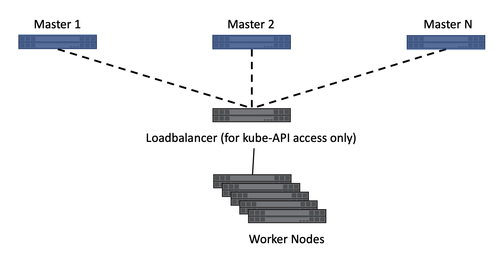
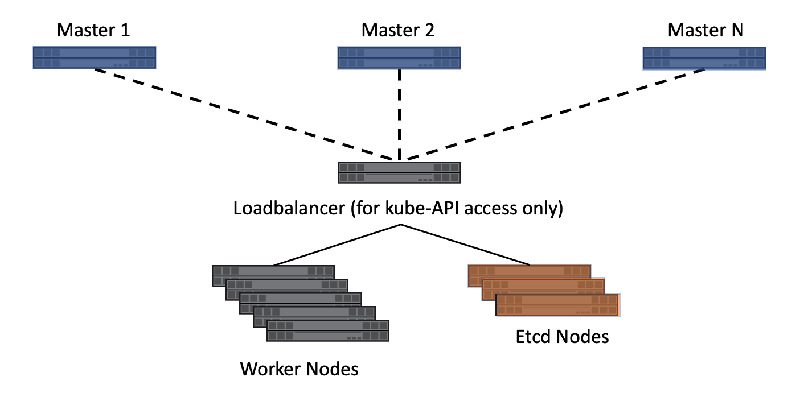
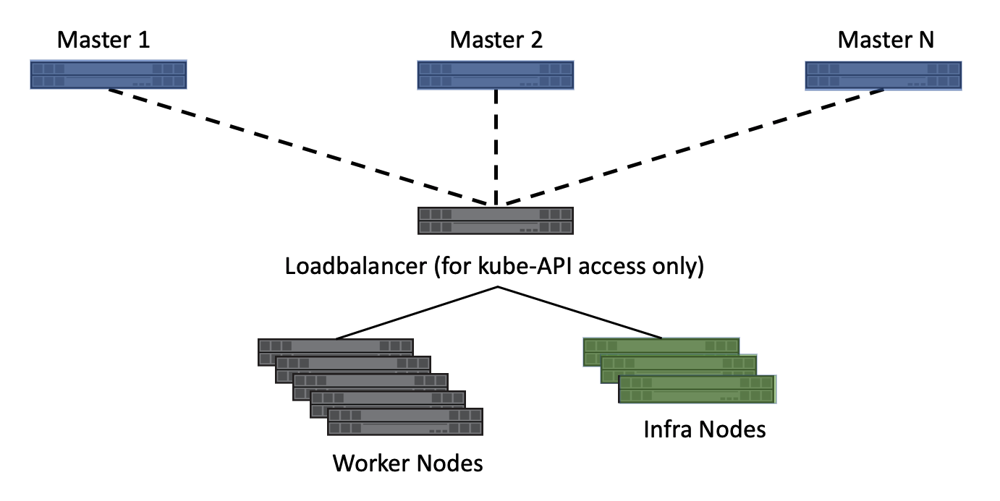

.. _kubernetes_cluster_architecture_considerations:

**************************************************
Kubernetes Cluster Architecture and Considerations
**************************************************

Kubernetes is extremely flexible and is capable of being deployed in many different configurations. It supports clusters as small as a single node and as large as a `few thousand <https://kubernetes.io/docs/setup/cluster-large/>`_. It can be deployed using either physical or virtual machines on premises or in the cloud. However, single node deployments are mainly used for testing and are not suitable for production workloads. Also, hyperscalers such as AWS, Google Cloud and Azure abstract some of the initial and basic deployment tasks away. When deploying Kubernetes, there are a number of considerations and decisions to make which can affect the applications and how they consume storage resources.

Cluster concepts and components
===============================

A Kubernetes cluster typically consists of two types of nodes, each responsible for different aspects of functionality:

* Master nodes – These nodes host the control plane aspects of the cluster and are responsible for, among other things, the API endpoint which the users interact with and provides scheduling for pods across resources. Typically,  these nodes are not used to schedule application workloads.
* Compute nodes – Nodes which are responsible for executing workloads for the cluster users.

The cluster has a number of Kubernetes intrinsic services which are deployed in the cluster. Depending on the service type, each service is deployed on only one type of node (master or compute) or on a mixture of node types. Some of these services, such as etcd and DNS, are mandatory for the cluster to be functional, while other services are optional. All of these services are deployed as pods within Kubernetes.

* etcd – It is a distributed key-value datastore.  It is used heavily by Kubernetes to track the state and manage the resources associated with the cluster.
* DNS – Kubernetes maintains an internal DNS service to provide local resolution for the applications which have been deployed.  This enables inter-pod communication to happen while referencing friendly names instead of internal IP addresses which can change as the container instances are scheduled.
* API Server - Kubernetes deploys the API server to allow interaction between kubernetes and the outside world. This is deployed on the master node(s).
* Dashboard – An optional component which provides a graphical interface to the cluster.
* Monitoring and logging – An optional components which can aid with resource reporting.

.. note::
   We have not discussed Kubernetes container networking to allow pods to communicate with each other, or to outside the cluster. The choice of using an overlay network (e.g. Flannel) or a straight Layer-3 solution (e.g. Calico) is out of the scope of this document and does not affect access to storage resources by the pods.  

Cluster architectures
=====================

There are three primary Kubernetes cluster architectures. These accommodate various methods of high availability and recoverability of the cluster, its services, and the applications running. Trident is installed the same no matter which Kubernetes architecture is chosen.

Master nodes are critical to the operation of the cluster.  If no masters are running, or the master nodes are unable to reach a quorum, then the cluster is unable to schedule and execute applications.  The master nodes are the control plane for the cluster and consequentially there should be special consideration given to their `sizing <https://kubernetes.io/docs/setup/cluster-large/#size-of-master-and-master-components>`_ and count.

Compute nodes are, generally speaking, much more disposable. However, extra resources must be built into the compute infrastructure to accommodate any workloads from failed nodes. Compute nodes can be added and removed from the cluster as needed quickly and easily to accommodate the scale of the applications which are being hosted.  This makes it very easy to burst, and reclaim, resources based on real-time application workload.

Single master, compute
----------------------

This architecture is the easiest to deploy but does not provide high availability of the core management services. In the event the master node is unavailable, no interaction can happen with the cluster until, at a minimum, the Kubernetes API server is returned to service.

This architecture can be useful for testing, qualification, proof-of-concept, and other non-production uses, however it should never be used for production deployments.

A single node used to host both the master service and the workloads is a variant of this architecture. Using a single node kubernetes cluster is useful when testing or experimenting with different concepts and capabilities. However, the limited scale and capacity make it unreasonable for more than very small tests. The Trident :ref: `quick start guide <Simple Kubernetes install>` outlines the process to instantiate a single node Kubernetes cluster with Trident that provides full functionality for testing and validation.

Multiple master, compute
------------------------

Having multiple master nodes ensures that services remain available should master node(s) fail. In order to facilitate availability of master services, they should be deployed with odd numbers (e.g. 3,5,7,9 etc.) so that quorum (master node majority) can be maintained should one or more masters fail. In the HA scenario, Kubernetes will maintain a copy of the etcd databases on each master, but hold elections for the control plane function leaders `kube-controller-manager` and `kube-scheduler` to avoid conflicts. The worker nodes can communicate with any master's API server through a load balancer. 

 Deploying with multiple masters is the minimum recommended configuration for most production clusters.

.. _figMultiMasterCluster:

     
     Multiple master architecture
 
Pros:
 
* Provides highly-available master services, ensuring that the loss of up to (n/2) – 1 master nodes will not affect cluster operations.

Cons:

* More complex initial setup.

Master, etcd, compute
---------------------

This architecture isolates the etcd cluster from the other master server services.  This removes workload from the master servers, enabling them to be sized smaller, and makes their scale out (or in) more simple.
Deploying a Kubernetes cluster using this model adds a degree of complexity, however, it adds flexibility to the scale, support, and management of the etcd service used by Kubernetes, which may be desirable to some organizations.

.. _figMultietcdCluster:

     Multiple master, etcd, compute architecture

Pros:

* Provides highly-available master services, ensuring that the loss of up to (n/2) – 1 master nodes will not affect cluster operations.
* Isolating etcd from the other master services reduces the workload for master servers.
* Decoupling etcd from the masters makes etcd administration and protection easier. Independent management allows for different protection and scaling schemes.

Cons:

* More complex initial setup.

Red Hat OpenShift infrastructure architecture
---------------------------------------------

In addition to the architectures referenced above, Red Hat's OpenShift introduces the concept of `infrastructure nodes <https://docs.openshift.com/container-platform/3.11/admin_guide/manage_nodes.html#infrastructure-nodes>`_. These nodes host cluster services such as log aggregation, metrics collection and reporting, container registry services, and overlay network management and routing.

`Red Hat recommends <https://docs.openshift.com/container-platform/3.11/admin_guide/manage_nodes.html#infrastructure-nodes>`_ a minimum of three infrastructure nodes for production deployments.  This ensures that the services have resources available and are able to migrate in the event of host maintenance or failure.

This architecture enables the services which are critical to the cluster, i.e. registry, overlay network routing, and others to be hosted on dedicated nodes. These dedicated nodes may have additional redundancy, different CPU/RAM requirements, and other low-level differences from compute nodes. This also makes adding and removing compute nodes as needed easier, without needing to worry about core services being affected by a node being evacuated.

.. _figMultiinfraCluster:

     
     OpenShift, Multiple master, infra, compute architecture

An additional option involves separating out the master and etcd roles into different servers in the same way as can be done in Kubernetes. This results in having master, etcd, infrastructure, and compute node roles. Further details, including examples of OpenShift node roles and potential deployment options, can be found in the `Red Hat documentation <https://docs.openshift.com/container-platform/3.11/install/index.html>`_.
 

Choosing an architecture
========================

Regardless of the architecture that you choose, it's important to understand the ramifications to high availability, scalability, and serviceability of the component services. Be sure to consider the effect on the applications being hosted by the Kubernetes or OpenShift cluster. The architecture of the storage infrastructure supporting the Kubernetes/OpenShift cluster and the hosted applications can also be affected by the chosen cluster architecture, such as where etcd is hosted.

