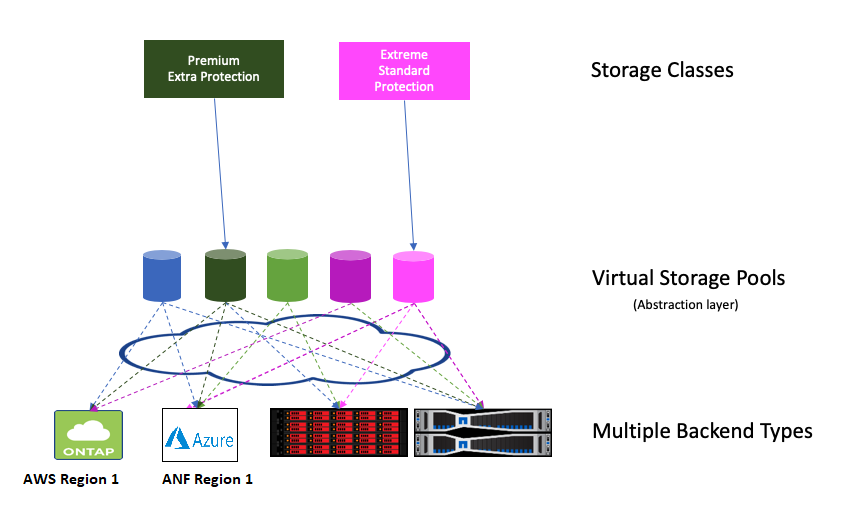

#####################
Virtual Storage Pools
#####################

Virtual storage pools provide a layer of
abstraction between Trident's storage backends and Kubernetes'
StorageClasses. They allow an administrator to define aspects like
location, performance, and protection for each backend in a common,
backend-agnostic way without making a StorageClass specify which
physical backend, backend pool, or backend type to use to meet desired
criteria.

Virtual Storage Pools can be defined on any of the Trident backends.

.. _figVirtualStoragePools:

    Virtual Storage Pools

The storage administrator defines the virtual pools and their aspects
in a backend's JSON or YAML definition file. Any aspect specified
outside the virtual pools list is global to the backend and will apply
to all the virtual pools, while each virtual pool may specify one or more
aspects individually (overriding any backend-global aspects).

Most aspects are specified in backend-specific terms. Crucially, the
aspect values are not exposed outside the backend's driver and
are not available for matching in StorageClasses. Instead, the
administrator defines one or more labels for each virtual pool. Each
label is a key:value pair, and labels may be common across unique backends.
Like aspects, labels may be specified per-pool or global to the backend.
Unlike aspects, which have predefined names and values, the administrator
has full discretion to define label keys and values as needed.

A StorageClass identifies which virtual pool(s) to use by referencing the
labels within a selector parameter. Virtual pool selectors support six operators:

+------------+------------------------------------+-------------------------------------------------------+
| Operator   | Example                            | Description                                           |
+============+====================================+=======================================================+
| ``=``      | performance=premium                | A pool's label value must match                       |
+------------+------------+-----------------------+-------------------------------------------------------+
| ``!=``     | performance!=extreme               | A pool's label value must not match                   |
+------------+------------------------------------+-------------------------------------------------------+
| ``in``     | location in (east, west)           | A pool's label value must be in the set of values     |
+------------+------------------------------------+-------------------------------------------------------+
| ``notin``  | performance notin (silver, bronze) | A pool's label value must not be in the set of values |
+------------+------------+-----------------------+-------------------------------------------------------+
| ``<key>``  | protection                         | A pool's label key must exist with any value          |
+------------+------------+-----------------------+-------------------------------------------------------+
| ``!<key>`` | !protection                        | A pool's label key must not exist                     |
+------------+------------------------------------+-------------------------------------------------------+

A selector may consist of multiple operators, delimited by semicolons;
all operators must succeed to match a virtual pool.

