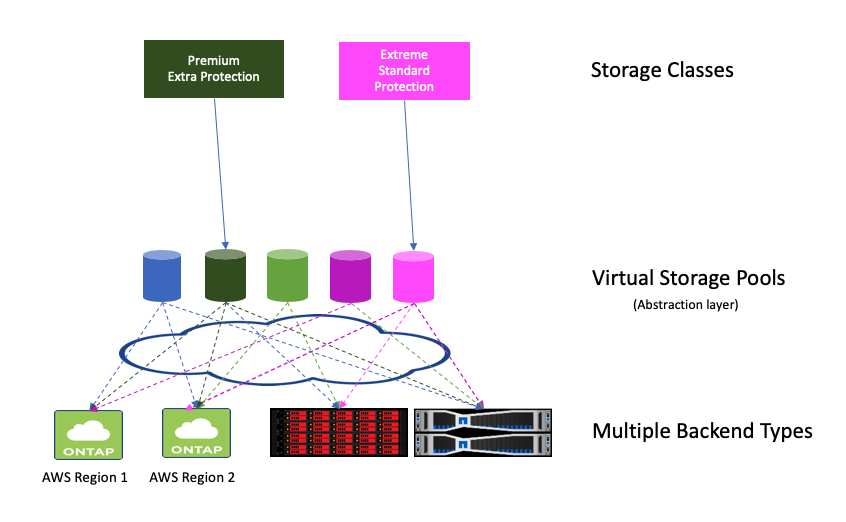

#############################
Cloud Volumes Service for AWS
#############################

.. warning::
  The NetApp Cloud Volumes Service for AWS does not support volumes less than 100 GB in size. To
  make it easier to deploy applications, Trident automatically creates 100 GB volumes if a
  smaller volume is requested. Future releases of the Cloud Volumes Service may remove this restriction.

Preparation
-----------

To create and use a Cloud Volumes Service (CVS) for AWS backend, you will need:

* An `AWS account configured with NetApp CVS`_
* API region, URL, and keys for your CVS account

Backend configuration options
-----------------------------

========================= =============================================================== ================================================
Parameter                 Description                                                     Default
========================= =============================================================== ================================================
version                   Always 1
storageDriverName         "aws-cvs"
backendName               Custom name for the storage backend                             Driver name + "_" + part of API key
apiRegion                 CVS account region
apiURL                    CVS account API URL
apiKey                    CVS account API key
secretKey                 CVS account secret key
nfsMountOptions           Fine-grained control of NFS mount options                       "-o nfsvers=3"
limitVolumeSize           Fail provisioning if requested volume size is above this value  "" (not enforced by default)
serviceLevel              The CVS service level for new volumes                           "standard"
========================= =============================================================== ================================================

The required values ``apiRegion``, ``apiURL``, ``apiKey``, and ``secretKey``
may be found in the CVS web portal in Account settings / API access.

Each backend provisions volumes in a single AWS region. To create volumes in
other regions, you can define additional backends.

The serviceLevel values for CVS on AWS are ``standard``, ``premium``, and ``extreme``.

You can control how each volume is provisioned by default using these options
in a special section of the configuration. For an example, see the
configuration examples below.

========================= =============================================================== ================================================
Parameter                 Description                                                     Default
========================= =============================================================== ================================================
exportRule                The export rule(s) for new volumes                              "0.0.0.0/0"
snapshotReserve           Percentage of volume reserved for snapshots                     "" (accept CVS default of 0)
size                      The size of new volumes                                         "100G"
========================= =============================================================== ================================================

The ``exportRule`` value must be a comma-separated list of any combination of
IPv4 addresses or IPv4 subnets in CIDR notation.

Virtual storage pools
---------------------

Trident's integration with the NetApp Cloud Volume Service for AWS supports virtual storage pools, which provide a layer of abstraction between Trident's storage backends and Kubernetes' StorageClasses. They allow an administrator to define aspects like location, performance, and protection for each backend in a common, backend-agnostic way without making a StorageClass specify which physical backend, backend pool, or backend type to use to meet desired criteria.

.. _figVirtualStoragePools:

    Virtual Storage Pools

The storage administrator defines the virtual pools and their aspects in a backend's JSON or YAML definition file.  Any aspect specified outside the virtual pools list is global to the backend and will apply to all virtual pools, while each virtual pool may specify one or more aspects individually (overriding any backend-global aspects).

Most aspects are specified in backend-specific terms, such as ``serviceLevel`` for the aws-cvs driver. Crucially, the aspect values are not exposed outside the backend's driver and are not available for matching in StorageClasses. Instead, the administrator defines one or more labels for each virtual pool. Each label is a key:value pair, and labels may be common across unique backends. Like aspects, labels may be specified per-pool or global to the backend.  Unlike aspects, which have predefined names and values, the administrator has full discretion to define label keys and values as needed.

A StorageClass identifies which virtual pool(s) to use by referencing the labels within a selector parameter. Virtual pool selectors support six operators:

+------------+------------------------------------+-------------------------------------------------------+
| Operator   | Example                            | Description                                           |
+============+====================================+=======================================================+
| ``=``      | performance=premium                | A pool's label value must match                       |
+------------+------------+-----------------------+-------------------------------------------------------+
| ``!=``     | performance!=extreme               | A pool's label value must not match                   |
+------------+------------------------------------+-------------------------------------------------------+
| ``in``     | location in (east, west)           | A pool's label value must be in the set of values     |
+------------+------------------------------------+-------------------------------------------------------+
| ``notin``  | performance notin (silver, bronze) | A pool's label value must not be in the set of values |
+------------+------------+-----------------------+-------------------------------------------------------+
| ``<key>``  | protection                         | A pool's label key must exist with any value          |
+------------+------------+-----------------------+-------------------------------------------------------+
| ``!<key>`` | !protection                        | A pool's label key must not exist                     |
+------------+------------------------------------+-------------------------------------------------------+

A selector may consist of multiple operators, delimited by semicolons; all operators must succeed to match a virtual pool.

Some example configurations are shown below. The first two examples show backend configurations without virtual pools. The last example shows a backend configuration with virtual pools and sample StorageClass definitions.

Example configurations
----------------------

**Example 1 - Minimal backend configuration for aws-cvs driver**

.. code-block:: json

    {
        "version": 1,
        "storageDriverName": "aws-cvs",
        "apiRegion": "us-east-1",
        "apiURL": "https://cds-aws-bundles.netapp.com:8080/v1",
        "apiKey": "znHczZsrrtHisIsAbOguSaPIKeyAZNchRAGzlzZE",
        "secretKey": "rR0rUmWXfNioN1KhtHisiSAnoTherboGuskey6pU"
    }

**Example 2 -  Backend configuration for aws-cvs driver with single service level**

This example shows a backend file that applies the same aspects to all Trident created storage in the AWS us-east-1 region.

.. code-block:: json

    {
        "version": 1,
        "storageDriverName": "aws-cvs",
        "backendName": "cvs-aws-us-east",
        "apiRegion": "us-east-1",
        "apiURL": "https://cds-aws-bundles.netapp.com:8080/v1",
        "apiKey": "znHczZsrrtHisIsAbOguSaPIKeyAZNchRAGzlzZE",
        "secretKey": "rR0rUmWXfNioN1KhtHisiSAnoTherboGuskey6pU",
        "nfsMountOptions": "vers=3,proto=tcp,timeo=600",
        "limitVolumeSize": "50Gi",
        "serviceLevel": "premium",
        "defaults": {
            "snapshotReserve": "5",
            "exportRule": "10.0.0.0/24,10.0.1.0/24,10.0.2.100",
            "size": "200Gi"
        }
    }

**Example 3 - Backend and storage class configuration for aws-cvs driver with virtual storage pools**

This example shows the backend definition file configured with virtual storage pools along with StorageClasses that refer back to them.

In the sample backend definition file shown below, specific defaults are set for all storage pools, which set the ``snapshotReserve`` at 5% and the ``exportRule`` to 0.0.0.0/0. The virtual storage pools are defined in the ``storage`` section. In this example, each individual storage pool sets its own ``serviceLevel``, and some pools overwrite the default values set above.

.. code-block:: json

    {
        "version": 1,
        "storageDriverName": "aws-cvs",
        "apiRegion": "us-east-1",
        "apiURL": "https://cds-aws-bundles.netapp.com:8080/v1",
        "apiKey": "EnterYourAPIKeyHere***********************",
        "secretKey": "EnterYourSecretKeyHere******************",
        "nfsMountOptions": "vers=3,proto=tcp,timeo=600",

        "defaults": {
            "snapshotReserve": "5",
            "exportRule": "0.0.0.0/0"
        },

        "labels": {
            "cloud": "aws"
        },
        "region": "us-east-1",

        "storage": [
            {
                "labels": {
                    "performance": "extreme",
                    "protection": "extra"
                },
                "serviceLevel": "extreme",
                "defaults": {
                    "snapshotReserve": "10",
                    "exportRule": "10.0.0.0/24"
                }
            },
            {
                "labels": {
                    "performance": "extreme",
                    "protection": "standard"
                },
                "serviceLevel": "extreme"
            },
            {
                "labels": {
                    "performance": "premium",
                    "protection": "extra"
                },
                "serviceLevel": "premium",
                "defaults": {
                    "snapshotReserve": "10"
                }
            },

            {
                "labels": {
                    "performance": "premium",
                    "protection": "standard"
                },
                "serviceLevel": "premium"
            },

            {
                "labels": {
                    "performance": "standard"
                },
                "serviceLevel": "standard"
            }
        ]
    }

The following StorageClass definitions refer to the above virtual storage pools. Using the ``parameters.selector`` field, each StorageClass calls out which virtual pool(s) may be used to host a volume. The volume will have the aspects defined in the chosen virtual pool.

The first StorageClass (``cvs-extreme-extra-protection``) will map to the first virtual storage pool. This is the only pool offering extreme performance with a snapshot reserve of 10%. The last StorageClass (``cvs-extra-protection``) calls out any storage pool which provides a snapshot reserve of 10%. Trident will decide which virtual storage pool is selected and will ensure the snapshot reserve requirement is met.

.. code-block:: yaml

    apiVersion: storage.k8s.io/v1
    kind: StorageClass
    metadata:
      name: cvs-extreme-extra-protection
    provisioner: netapp.io/trident
    parameters:
      selector: "performance=extreme; protection=extra"
    allowVolumeExpansion: true
    ---
    apiVersion: storage.k8s.io/v1
    kind: StorageClass
    metadata:
      name: cvs-extreme-standard-protection
    provisioner: netapp.io/trident
    parameters:
      selector: "performance=premium; protection=standard"
    allowVolumeExpansion: true
    ---
    apiVersion: storage.k8s.io/v1
    kind: StorageClass
    metadata:
      name: cvs-premium-extra-protection
    provisioner: netapp.io/trident
    parameters:
      selector: "performance=premium; protection=extra"
    allowVolumeExpansion: true
    ---
    apiVersion: storage.k8s.io/v1
    kind: StorageClass
    metadata:
      name: cvs-premium
    provisioner: netapp.io/trident
    parameters:
      selector: "performance=premium; protection=standard"
    allowVolumeExpansion: true
    ---
    apiVersion: storage.k8s.io/v1
    kind: StorageClass
    metadata:
      name: cvs-standard
    provisioner: netapp.io/trident
    parameters:
      selector: "performance=standard"
    allowVolumeExpansion: true
    ---
    apiVersion: storage.k8s.io/v1
    kind: StorageClass
    metadata:
      name: cvs-extra-protection
    provisioner: netapp.io/trident
    parameters:
      selector: "protection=extra"
    allowVolumeExpansion: true
 
.. _AWS account configured with NetApp CVS: https://cloud.netapp.com/cloud-volumes-service-for-aws?utm_source=NetAppTrident_ReadTheDocs&utm_campaign=Trident
